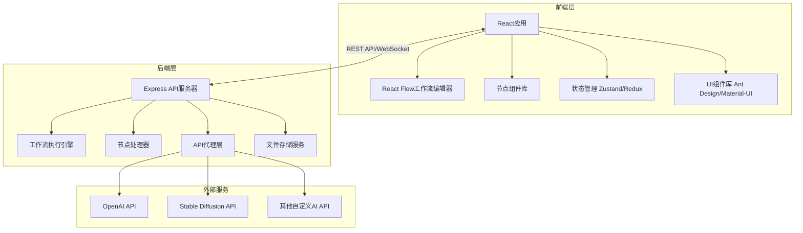
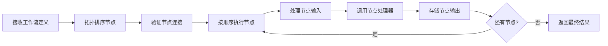

# AI生图工作流系统 - 架构设计文档

## 1. 系统架构概览



## 2. 技术栈详细说明

### 2.1 前端技术栈
- **框架**: React 18+ with TypeScript
- **工作流编辑器**: React Flow (专业的节点编辑器库)
- **状态管理**: Zustand (轻量级) 或 Redux Toolkit
- **UI组件库**: Ant Design 或 Material-UI
- **HTTP客户端**: Axios
- **实时通信**: Socket.io-client (用于工作流执行状态更新)
- **样式方案**: Tailwind CSS + CSS Modules
- **构建工具**: Vite

### 2.2 后端技术栈
- **运行时**: Node.js 18+
- **框架**: Express.js with TypeScript
- **实时通信**: Socket.io
- **文件处理**: Multer (上传), Sharp (图片处理)
- **HTTP客户端**: Axios (调用外部AI API)
- **数据存储**: 
  - 工作流定义: JSON文件或SQLite
  - 图片/文件: 本地文件系统或云存储
- **任务队列**: Bull (基于Redis，可选)

## 3. 核心模块设计

### 3.1 节点系统

#### 节点基类结构
```typescript
interface BaseNode {
  id: string;
  type: string;
  position: { x: number; y: number };
  data: {
    label: string;
    inputs: NodeInput[];
    outputs: NodeOutput[];
    config: Record<string, any>;
  };
}

interface NodeInput {
  id: string;
  name: string;
  type: 'text' | 'image' | 'number' | 'any';
  required: boolean;
}

interface NodeOutput {
  id: string;
  name: string;
  type: 'text' | 'image' | 'number' | 'any';
}
```

#### 节点类型定义

1. **输入节点**
   - [`TextInputNode`]: 文本输入框
   - [`ImageInputNode`]: 图片上传/URL输入
   - [`NumberInputNode`]: 数字输入

2. **处理节点**
   - [`AIImageGenerationNode`]: AI生图节点（支持多种API）
   - [`TextMergeNode`]: 文本合并节点
   - [`TextTemplateNode`]: 文本模板节点
   - [`ImageResizeNode`]: 图片调整大小
   - [`ImageFilterNode`]: 图片滤镜

3. **输出节点**
   - [`ImageOutputNode`]: 图片预览/下载
   - [`TextOutputNode`]: 文本显示
   - [`FileDownloadNode`]: 文件下载

4. **逻辑节点**
   - [`ConditionalNode`]: 条件判断
   - [`LoopNode`]: 循环处理（可选，高级功能）

### 3.2 工作流执行引擎

#### 执行流程


#### 执行引擎核心功能
- 拓扑排序：确定节点执行顺序
- 数据流管理：在节点间传递数据
- 错误处理：节点执行失败的处理
- 进度追踪：实时更新执行状态
- 缓存机制：避免重复计算

### 3.3 API代理层

#### 设计目的
- 统一不同AI服务的接口
- 管理API密钥
- 请求限流和重试
- 成本追踪

#### API适配器接口
```typescript
interface AIAPIAdapter {
  name: string;
  generateImage(params: ImageGenerationParams): Promise<ImageResult>;
  validateConfig(config: APIConfig): boolean;
}

// 支持的API适配器
- OpenAIAdapter (DALL-E)
- StableDiffusionAdapter
- CustomAPIAdapter (用户自定义)
```

## 4. 数据模型

### 4.1 工作流定义
```typescript
interface Workflow {
  id: string;
  name: string;
  description: string;
  nodes: BaseNode[];
  edges: Edge[];
  createdAt: Date;
  updatedAt: Date;
}

interface Edge {
  id: string;
  source: string;      // 源节点ID
  sourceHandle: string; // 源节点输出ID
  target: string;      // 目标节点ID
  targetHandle: string; // 目标节点输入ID
}
```

### 4.2 执行记录
```typescript
interface ExecutionRecord {
  id: string;
  workflowId: string;
  status: 'pending' | 'running' | 'completed' | 'failed';
  startTime: Date;
  endTime?: Date;
  nodeResults: Record<string, any>;
  error?: string;
}
```

## 5. API设计

### 5.1 RESTful API端点

#### 工作流管理
- `GET /api/workflows` - 获取工作流列表
- `GET /api/workflows/:id` - 获取工作流详情
- `POST /api/workflows` - 创建工作流
- `PUT /api/workflows/:id` - 更新工作流
- `DELETE /api/workflows/:id` - 删除工作流

#### 工作流执行
- `POST /api/workflows/:id/execute` - 执行工作流
- `GET /api/executions/:id` - 获取执行状态
- `GET /api/executions/:id/results` - 获取执行结果

#### 节点管理
- `GET /api/nodes/types` - 获取所有节点类型
- `GET /api/nodes/types/:type` - 获取节点类型详情

#### API配置
- `GET /api/configs/apis` - 获取API配置列表
- `POST /api/configs/apis` - 添加API配置
- `PUT /api/configs/apis/:id` - 更新API配置
- `DELETE /api/configs/apis/:id` - 删除API配置

#### 文件管理
- `POST /api/files/upload` - 上传文件
- `GET /api/files/:id` - 获取文件

### 5.2 WebSocket事件

#### 客户端 -> 服务器
- `workflow:execute` - 执行工作流
- `workflow:cancel` - 取消执行

#### 服务器 -> 客户端
- `execution:started` - 执行开始
- `execution:progress` - 执行进度更新
- `execution:node-completed` - 节点完成
- `execution:completed` - 执行完成
- `execution:failed` - 执行失败

## 6. 前端页面结构

### 6.1 主要页面
1. **工作流编辑器页面** [`/editor/:id`]
   - 节点面板（可拖拽的节点列表）
   - 画布区域（React Flow）
   - 属性面板（选中节点的配置）
   - 工具栏（保存、执行、导入/导出）

2. **工作流列表页面** [`/workflows`]
   - 工作流卡片列表
   - 创建新工作流按钮
   - 搜索和筛选

3. **API配置页面** [`/settings/apis`]
   - API配置列表
   - 添加/编辑API配置表单
   - API测试功能

4. **执行历史页面** [`/executions`]
   - 执行记录列表
   - 执行详情查看

### 6.2 组件层次结构
```
App
├── Layout
│   ├── Header
│   ├── Sidebar
│   └── Content
├── WorkflowEditor
│   ├── NodePanel
│   ├── FlowCanvas
│   ├── PropertyPanel
│   └── Toolbar
├── WorkflowList
├── APISettings
└── ExecutionHistory
```

## 7. 项目目录结构

```
ai-workflow/
├── client/                    # 前端项目
│   ├── src/
│   │   ├── components/       # 通用组件
│   │   ├── pages/           # 页面组件
│   │   ├── nodes/           # 节点组件
│   │   ├── store/           # 状态管理
│   │   ├── services/        # API服务
│   │   ├── types/           # TypeScript类型定义
│   │   ├── utils/           # 工具函数
│   │   ├── hooks/           # 自定义Hooks
│   │   ├── App.tsx
│   │   └── main.tsx
│   ├── public/
│   ├── package.json
│   └── vite.config.ts
│
├── server/                   # 后端项目
│   ├── src/
│   │   ├── routes/          # API路由
│   │   ├── controllers/     # 控制器
│   │   ├── services/        # 业务逻辑
│   │   ├── models/          # 数据模型
│   │   ├── nodes/           # 节点处理器
│   │   ├── engine/          # 工作流执行引擎
│   │   ├── adapters/        # AI API适配器
│   │   ├── middleware/      # 中间件
│   │   ├── utils/           # 工具函数
│   │   ├── types/           # TypeScript类型定义
│   │   └── index.ts
│   ├── uploads/             # 上传文件存储
│   ├── data/                # 数据存储（工作流、配置等）
│   ├── package.json
│   └── tsconfig.json
│
├── shared/                   # 前后端共享代码
│   ├── types/               # 共享类型定义
│   └── constants/           # 共享常量
│
├── plans/                    # 项目规划文档
├── Idle/                     # 协作上下文
│   └── copilot.md
├── package.json              # 根package.json (monorepo配置)
└── README.md
```

## 8. 开发阶段规划

### 阶段1: 项目基础搭建
- 初始化前后端项目结构
- 配置开发环境和构建工具
- 搭建基础UI框架

### 阶段2: 核心功能开发
- 实现React Flow工作流编辑器
- 开发基础节点类型
- 实现工作流执行引擎

### 阶段3: AI集成
- 实现API代理层
- 集成OpenAI DALL-E
- 集成Stable Diffusion
- 支持自定义API

### 阶段4: 功能完善
- 工作流保存/加载
- 执行历史记录
- API配置管理
- 错误处理和用户反馈

### 阶段5: 优化和测试
- 性能优化
- UI/UX优化
- 测试和bug修复

## 9. 技术难点和解决方案

### 9.1 工作流执行顺序
**难点**: 确定节点的正确执行顺序
**解决方案**: 使用拓扑排序算法，基于节点的依赖关系

### 9.2 实时状态更新
**难点**: 工作流执行时的实时状态反馈
**解决方案**: 使用WebSocket (Socket.io) 进行双向通信

### 9.3 大文件处理
**难点**: 图片文件的上传和处理
**解决方案**: 
- 使用流式上传
- 图片压缩和优化
- 考虑使用云存储（可选）

### 9.4 API限流和重试
**难点**: 外部API调用的稳定性
**解决方案**: 
- 实现指数退避重试机制
- 请求队列管理
- 错误处理和降级策略

## 10. 安全考虑

- API密钥加密存储
- 文件上传类型和大小限制
- 请求频率限制
- CORS配置
- 输入验证和清理

## 11. 扩展性考虑

- 插件系统：支持自定义节点类型
- 模板市场：预设工作流模板
- 多用户支持：用户认证和权限管理（未来）
- 云端同步：工作流云端存储（未来）

---
**文档版本**: 1.0
**创建日期**: 2026-02-11
**最后更新**: 2026-02-11
