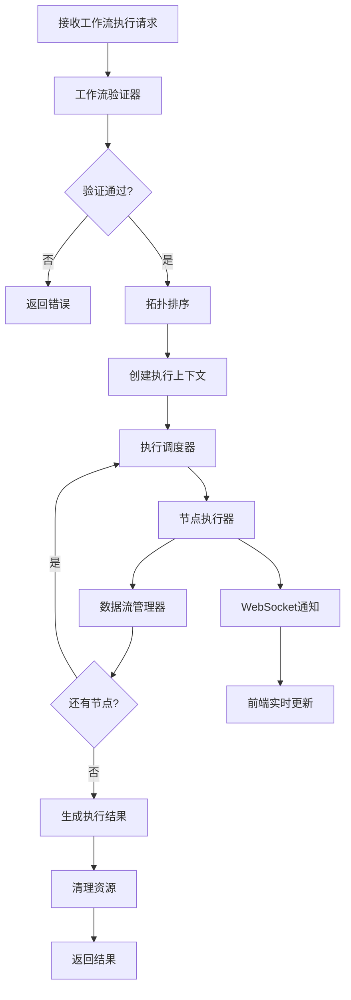

# 工作流执行引擎设计

## 1. 执行引擎架构



## 2. 核心组件设计

### 2.1 工作流验证器 (Workflow Validator)

```typescript
// server/src/engine/validator.ts

export interface ValidationError {
  type: 'missing_input' | 'invalid_connection' | 'circular_dependency' | 'invalid_config';
  nodeId: string;
  message: string;
}

export class WorkflowValidator {
  validate(workflow: Workflow): ValidationError[] {
    const errors: ValidationError[] = [];
    
    // 1. 检查节点配置
    errors.push(...this.validateNodeConfigs(workflow.nodes));
    
    // 2. 检查连接有效性
    errors.push(...this.validateConnections(workflow.nodes, workflow.edges));
    
    // 3. 检查必需输入
    errors.push(...this.validateRequiredInputs(workflow.nodes, workflow.edges));
    
    // 4. 检查循环依赖
    errors.push(...this.validateCircularDependencies(workflow.nodes, workflow.edges));
    
    return errors;
  }
  
  private validateNodeConfigs(nodes: WorkflowNode[]): ValidationError[] {
    const errors: ValidationError[] = [];
    
    for (const node of nodes) {
      const nodeType = NodeRegistry.get(node.type);
      if (!nodeType) {
        errors.push({
          type: 'invalid_config',
          nodeId: node.id,
          message: `未知的节点类型: ${node.type}`
        });
        continue;
      }
      
      // 验证配置
      for (const schema of nodeType.configSchema) {
        if (schema.required && !node.data.config[schema.key]) {
          errors.push({
            type: 'invalid_config',
            nodeId: node.id,
            message: `缺少必需配置: ${schema.label}`
          });
        }
      }
    }
    
    return errors;
  }
  
  private validateConnections(
    nodes: WorkflowNode[],
    edges: WorkflowEdge[]
  ): ValidationError[] {
    const errors: ValidationError[] = [];
    const nodeMap = new Map(nodes.map(n => [n.id, n]));
    
    for (const edge of edges) {
      const sourceNode = nodeMap.get(edge.source);
      const targetNode = nodeMap.get(edge.target);
      
      if (!sourceNode || !targetNode) {
        continue; // 节点不存在，已在其他地方报错
      }
      
      // 检查输出端口
      const sourceOutput = sourceNode.data.outputs.find(
        o => o.id === edge.sourceHandle
      );
      if (!sourceOutput) {
        errors.push({
          type: 'invalid_connection',
          nodeId: edge.source,
          message: `无效的输出端口: ${edge.sourceHandle}`
        });
      }
      
      // 检查输入端口
      const targetInput = targetNode.data.inputs.find(
        i => i.id === edge.targetHandle
      );
      if (!targetInput) {
        errors.push({
          type: 'invalid_connection',
          nodeId: edge.target,
          message: `无效的输入端口: ${edge.targetHandle}`
        });
      }
      
      // 检查类型兼容性
      if (sourceOutput && targetInput) {
        if (!this.isTypeCompatible(sourceOutput.type, targetInput.type)) {
          errors.push({
            type: 'invalid_connection',
            nodeId: edge.target,
            message: `类型不兼容: ${sourceOutput.type} -> ${targetInput.type}`
          });
        }
      }
    }
    
    return errors;
  }
  
  private validateRequiredInputs(
    nodes: WorkflowNode[],
    edges: WorkflowEdge[]
  ): ValidationError[] {
    const errors: ValidationError[] = [];
    const connectedInputs = new Set(
      edges.map(e => `${e.target}:${e.targetHandle}`)
    );
    
    for (const node of nodes) {
      for (const input of node.data.inputs) {
        if (input.required) {
          const key = `${node.id}:${input.id}`;
          if (!connectedInputs.has(key)) {
            errors.push({
              type: 'missing_input',
              nodeId: node.id,
              message: `缺少必需输入: ${input.name}`
            });
          }
        }
      }
    }
    
    return errors;
  }
  
  private validateCircularDependencies(
    nodes: WorkflowNode[],
    edges: WorkflowEdge[]
  ): ValidationError[] {
    const errors: ValidationError[] = [];
    const graph = this.buildGraph(nodes, edges);
    const visited = new Set<string>();
    const recursionStack = new Set<string>();
    
    const hasCycle = (nodeId: string): boolean => {
      visited.add(nodeId);
      recursionStack.add(nodeId);
      
      const neighbors = graph.get(nodeId) || [];
      for (const neighbor of neighbors) {
        if (!visited.has(neighbor)) {
          if (hasCycle(neighbor)) return true;
        } else if (recursionStack.has(neighbor)) {
          return true;
        }
      }
      
      recursionStack.delete(nodeId);
      return false;
    };
    
    for (const node of nodes) {
      if (!visited.has(node.id)) {
        if (hasCycle(node.id)) {
          errors.push({
            type: 'circular_dependency',
            nodeId: node.id,
            message: '检测到循环依赖'
          });
        }
      }
    }
    
    return errors;
  }
  
  private isTypeCompatible(sourceType: NodeDataType, targetType: NodeDataType): boolean {
    if (targetType === 'any') return true;
    if (sourceType === targetType) return true;
    return false;
  }
  
  private buildGraph(
    nodes: WorkflowNode[],
    edges: WorkflowEdge[]
  ): Map<string, string[]> {
    const graph = new Map<string, string[]>();
    
    for (const node of nodes) {
      graph.set(node.id, []);
    }
    
    for (const edge of edges) {
      const neighbors = graph.get(edge.source) || [];
      neighbors.push(edge.target);
      graph.set(edge.source, neighbors);
    }
    
    return graph;
  }
}
```

### 2.2 拓扑排序器 (Topological Sorter)

```typescript
// server/src/engine/sorter.ts

export class TopologicalSorter {
  sort(nodes: WorkflowNode[], edges: WorkflowEdge[]): string[] {
    const graph = this.buildGraph(nodes, edges);
    const inDegree = this.calculateInDegree(nodes, edges);
    const queue: string[] = [];
    const result: string[] = [];
    
    // 找到所有入度为0的节点（起始节点）
    for (const [nodeId, degree] of inDegree.entries()) {
      if (degree === 0) {
        queue.push(nodeId);
      }
    }
    
    // Kahn算法
    while (queue.length > 0) {
      const nodeId = queue.shift()!;
      result.push(nodeId);
      
      const neighbors = graph.get(nodeId) || [];
      for (const neighbor of neighbors) {
        const degree = inDegree.get(neighbor)! - 1;
        inDegree.set(neighbor, degree);
        
        if (degree === 0) {
          queue.push(neighbor);
        }
      }
    }
    
    return result;
  }
  
  private buildGraph(
    nodes: WorkflowNode[],
    edges: WorkflowEdge[]
  ): Map<string, string[]> {
    const graph = new Map<string, string[]>();
    
    for (const node of nodes) {
      graph.set(node.id, []);
    }
    
    for (const edge of edges) {
      const neighbors = graph.get(edge.source) || [];
      neighbors.push(edge.target);
      graph.set(edge.source, neighbors);
    }
    
    return graph;
  }
  
  private calculateInDegree(
    nodes: WorkflowNode[],
    edges: WorkflowEdge[]
  ): Map<string, number> {
    const inDegree = new Map<string, number>();
    
    for (const node of nodes) {
      inDegree.set(node.id, 0);
    }
    
    for (const edge of edges) {
      const degree = inDegree.get(edge.target)! + 1;
      inDegree.set(edge.target, degree);
    }
    
    return inDegree;
  }
}
```

### 2.3 执行上下文 (Execution Context)

```typescript
// server/src/engine/context.ts

export class ExecutionContext {
  private nodeResults: Map<string, any> = new Map();
  private nodeStatus: Map<string, NodeStatus> = new Map();
  
  constructor(
    public readonly executionId: string,
    public readonly workflowId: string,
    public readonly workflow: Workflow
  ) {}
  
  setNodeResult(nodeId: string, outputs: Record<string, any>) {
    this.nodeResults.set(nodeId, outputs);
  }
  
  getNodeResult(nodeId: string): Record<string, any> | undefined {
    return this.nodeResults.get(nodeId);
  }
  
  setNodeStatus(nodeId: string, status: NodeStatus) {
    this.nodeStatus.set(nodeId, status);
  }
  
  getNodeStatus(nodeId: string): NodeStatus | undefined {
    return this.nodeStatus.get(nodeId);
  }
  
  getNodeInputs(nodeId: string): Record<string, any> {
    const node = this.workflow.nodes.find(n => n.id === nodeId);
    if (!node) return {};
    
    const inputs: Record<string, any> = {};
    
    // 从连接的边获取输入
    const incomingEdges = this.workflow.edges.filter(e => e.target === nodeId);
    
    for (const edge of incomingEdges) {
      const sourceResult = this.nodeResults.get(edge.source);
      if (sourceResult) {
        const value = sourceResult[edge.sourceHandle];
        inputs[edge.targetHandle] = value;
      }
    }
    
    return inputs;
  }
  
  getAllResults(): Record<string, any> {
    return Object.fromEntries(this.nodeResults);
  }
}

type NodeStatus = 'pending' | 'running' | 'success' | 'error';
```

### 2.4 节点执行器 (Node Executor)

```typescript
// server/src/engine/executor.ts

export class NodeExecutor {
  constructor(
    private processorRegistry: ProcessorRegistry,
    private eventEmitter: EventEmitter
  ) {}
  
  async execute(
    nodeId: string,
    context: ExecutionContext
  ): Promise<void> {
    const node = context.workflow.nodes.find(n => n.id === nodeId);
    if (!node) {
      throw new Error(`节点不存在: ${nodeId}`);
    }
    
    try {
      // 更新状态为运行中
      context.setNodeStatus(nodeId, 'running');
      this.emitProgress(context, nodeId, 'running');
      
      // 获取节点处理器
      const processor = this.processorRegistry.get(node.type);
      if (!processor) {
        throw new Error(`未找到节点处理器: ${node.type}`);
      }
      
      // 获取输入
      const inputs = context.getNodeInputs(nodeId);
      
      // 执行节点
      const executionContext: NodeExecutionContext = {
        nodeId,
        inputs,
        config: node.data.config,
        workflowId: context.workflowId,
        executionId: context.executionId
      };
      
      const result = await processor.execute(executionContext);
      
      // 保存结果
      context.setNodeResult(nodeId, result.outputs);
      context.setNodeStatus(nodeId, 'success');
      this.emitProgress(context, nodeId, 'success', result.outputs);
      
    } catch (error) {
      // 错误处理
      context.setNodeStatus(nodeId, 'error');
      this.emitProgress(context, nodeId, 'error', undefined, error.message);
      throw error;
    }
  }
  
  private emitProgress(
    context: ExecutionContext,
    nodeId: string,
    status: NodeStatus,
    outputs?: any,
    error?: string
  ) {
    this.eventEmitter.emit('node:progress', {
      executionId: context.executionId,
      nodeId,
      status,
      outputs,
      error
    });
  }
}
```

### 2.5 工作流执行引擎 (Workflow Engine)

```typescript
// server/src/engine/engine.ts

export class WorkflowEngine {
  private validator: WorkflowValidator;
  private sorter: TopologicalSorter;
  private executor: NodeExecutor;
  private eventEmitter: EventEmitter;
  
  constructor(
    processorRegistry: ProcessorRegistry,
    eventEmitter: EventEmitter
  ) {
    this.validator = new WorkflowValidator();
    this.sorter = new TopologicalSorter();
    this.executor = new NodeExecutor(processorRegistry, eventEmitter);
    this.eventEmitter = eventEmitter;
  }
  
  async execute(workflow: Workflow): Promise<ExecutionResult> {
    const executionId = uuid();
    
    try {
      // 1. 验证工作流
      const errors = this.validator.validate(workflow);
      if (errors.length > 0) {
        return {
          executionId,
          status: 'failed',
          errors: errors.map(e => e.message)
        };
      }
      
      // 2. 拓扑排序
      const executionOrder = this.sorter.sort(workflow.nodes, workflow.edges);
      
      // 3. 创建执行上下文
      const context = new ExecutionContext(
        executionId,
        workflow.id,
        workflow
      );
      
      // 4. 发送开始事件
      this.eventEmitter.emit('execution:started', {
        executionId,
        workflowId: workflow.id,
        totalNodes: executionOrder.length
      });
      
      // 5. 按顺序执行节点
      for (let i = 0; i < executionOrder.length; i++) {
        const nodeId = executionOrder[i];
        
        await this.executor.execute(nodeId, context);
        
        // 发送进度更新
        this.eventEmitter.emit('execution:progress', {
          executionId,
          progress: ((i + 1) / executionOrder.length) * 100,
          completedNodes: i + 1,
          totalNodes: executionOrder.length
        });
      }
      
      // 6. 执行完成
      const results = context.getAllResults();
      
      this.eventEmitter.emit('execution:completed', {
        executionId,
        results
      });
      
      return {
        executionId,
        status: 'completed',
        results
      };
      
    } catch (error) {
      // 执行失败
      this.eventEmitter.emit('execution:failed', {
        executionId,
        error: error.message
      });
      
      return {
        executionId,
        status: 'failed',
        errors: [error.message]
      };
    }
  }
  
  async cancel(executionId: string): Promise<void> {
    // 取消执行（未来实现）
    this.eventEmitter.emit('execution:cancelled', { executionId });
  }
}

export interface ExecutionResult {
  executionId: string;
  status: 'completed' | 'failed' | 'cancelled';
  results?: Record<string, any>;
  errors?: string[];
}
```

## 3. 处理器注册表

```typescript
// server/src/engine/registry.ts

export class ProcessorRegistry {
  private processors: Map<string, BaseNodeProcessor> = new Map();
  
  register(processor: BaseNodeProcessor) {
    this.processors.set(processor.type, processor);
  }
  
  get(type: string): BaseNodeProcessor | undefined {
    return this.processors.get(type);
  }
  
  getAll(): BaseNodeProcessor[] {
    return Array.from(this.processors.values());
  }
}

// 初始化注册表
export function createProcessorRegistry(
  apiAdapterFactory: APIAdapterFactory
): ProcessorRegistry {
  const registry = new ProcessorRegistry();
  
  // 注册所有处理器
  registry.register(new TextInputProcessor());
  registry.register(new ImageInputProcessor());
  registry.register(new TextOutputProcessor());
  registry.register(new ImageOutputProcessor());
  registry.register(new TextMergeProcessor());
  registry.register(new TextTemplateProcessor());
  registry.register(new ImageResizeProcessor());
  registry.register(new AIImageGenerationProcessor(apiAdapterFactory));
  
  return registry;
}
```

## 4. WebSocket事件系统

```typescript
// server/src/engine/events.ts

export class ExecutionEventHandler {
  constructor(private io: Server) {}
  
  setupListeners(eventEmitter: EventEmitter) {
    // 执行开始
    eventEmitter.on('execution:started', (data) => {
      this.io.to(data.executionId).emit('execution:started', data);
    });
    
    // 节点进度
    eventEmitter.on('node:progress', (data) => {
      this.io.to(data.executionId).emit('node:progress', data);
    });
    
    // 执行进度
    eventEmitter.on('execution:progress', (data) => {
      this.io.to(data.executionId).emit('execution:progress', data);
    });
    
    // 执行完成
    eventEmitter.on('execution:completed', (data) => {
      this.io.to(data.executionId).emit('execution:completed', data);
    });
    
    // 执行失败
    eventEmitter.on('execution:failed', (data) => {
      this.io.to(data.executionId).emit('execution:failed', data);
    });
    
    // 执行取消
    eventEmitter.on('execution:cancelled', (data) => {
      this.io.to(data.executionId).emit('execution:cancelled', data);
    });
  }
  
  handleConnection(socket: Socket) {
    // 客户端加入执行房间
    socket.on('join:execution', (executionId: string) => {
      socket.join(executionId);
    });
    
    // 客户端离开执行房间
    socket.on('leave:execution', (executionId: string) => {
      socket.leave(executionId);
    });
  }
}
```

## 5. 使用示例

```typescript
// server/src/routes/workflow.ts

router.post('/workflows/:id/execute', async (req, res) => {
  try {
    const workflowId = req.params.id;
    const workflow = await workflowService.getWorkflow(workflowId);
    
    if (!workflow) {
      return res.status(404).json({ error: '工作流不存在' });
    }
    
    // 异步执行工作流
    const result = await workflowEngine.execute(workflow);
    
    // 保存执行记录
    await executionService.saveExecution({
      id: result.executionId,
      workflowId,
      status: result.status,
      results: result.results,
      errors: result.errors,
      startTime: new Date(),
      endTime: new Date()
    });
    
    res.json(result);
    
  } catch (error) {
    res.status(500).json({ error: error.message });
  }
});
```

## 6. 前端集成

```typescript
// client/src/services/execution.ts

export class ExecutionService {
  private socket: Socket;
  
  constructor() {
    this.socket = io('http://localhost:3000');
  }
  
  async executeWorkflow(workflowId: string): Promise<string> {
    const response = await axios.post(
      `/api/workflows/${workflowId}/execute`
    );
    
    const executionId = response.data.executionId;
    
    // 加入执行房间
    this.socket.emit('join:execution', executionId);
    
    return executionId;
  }
  
  onExecutionStarted(callback: (data: any) => void) {
    this.socket.on('execution:started', callback);
  }
  
  onNodeProgress(callback: (data: any) => void) {
    this.socket.on('node:progress', callback);
  }
  
  onExecutionProgress(callback: (data: any) => void) {
    this.socket.on('execution:progress', callback);
  }
  
  onExecutionCompleted(callback: (data: any) => void) {
    this.socket.on('execution:completed', callback);
  }
  
  onExecutionFailed(callback: (data: any) => void) {
    this.socket.on('execution:failed', callback);
  }
  
  cleanup(executionId: string) {
    this.socket.emit('leave:execution', executionId);
  }
}
```

## 7. 性能优化

### 7.1 并行执行
对于没有依赖关系的节点，可以并行执行：

```typescript
async executeParallel(
  nodeIds: string[],
  context: ExecutionContext
): Promise<void> {
  await Promise.all(
    nodeIds.map(nodeId => this.executor.execute(nodeId, context))
  );
}
```

### 7.2 结果缓存
对于相同输入的节点，可以缓存结果：

```typescript
private resultCache: Map<string, any> = new Map();

private getCacheKey(nodeId: string, inputs: any): string {
  return `${nodeId}:${JSON.stringify(inputs)}`;
}
```

### 7.3 超时控制
为节点执行设置超时：

```typescript
async executeWithTimeout(
  nodeId: string,
  context: ExecutionContext,
  timeout: number = 60000
): Promise<void> {
  const timeoutPromise = new Promise((_, reject) => {
    setTimeout(() => reject(new Error('执行超时')), timeout);
  });
  
  await Promise.race([
    this.execute(nodeId, context),
    timeoutPromise
  ]);
}
```

---
**最后更新**: 2026-02-11
